# TILog (틸로그)

매일의 학습 기록(TIL, Today I Learned)을 습관으로 만들고, 스트릭·잔디 히트맵과 AI 주간 리포트로
성장 과정을 시각화하며, 구독 기반 페이백으로 꾸준한 기록을 장려하는 개발자용 학습 기록 플랫폼입니다.

- **프로젝트 기간**: 2026.05.28 ~ 2026.06.07
- **팀 구성**: 6인 (백엔드·프론트엔드 통합)
- **담당**: 작성 이력·스트릭·잔디 히트맵, 구독 상태 관리·자동 갱신·페이백, 마이페이지 프론트엔드, 인증 연동 및 초기 환경 구성
- **배포**: [tilog.n-e.kr](https://tilog.n-e.kr) <sup>※ 비용·운영 상황에 따라 일시 중단될 수 있습니다</sup>
- **테스트 계정**: [`demo@tilog.kr` / `tilogDemo26!`] <sup>※ 매일 자정 데이터 초기화</sup>
- **시연 영상**: [YouTube에서 보기](https://www.youtube.com/watch?v=7DGHc91wHjw)

> 본 저장소는 6인 팀 프로젝트의 백엔드와 프론트엔드 저장소를 개인 포트폴리오 용도로 통합한
> 저장소입니다. `backend/`, `frontend/` 디렉터리는 `git subtree`로 가져와 각 폴더의 원본 커밋
> 이력을 그대로 유지하고 있습니다.
> - 팀 원본 백엔드 저장소: https://github.com/TILOGER/tilog-backend
> - 팀 원본 프론트엔드 저장소: https://github.com/TILOGER/tilog-frontend
> - Figma 디자인: https://www.figma.com/design/rXPQm12x7OslfOKFnxrxfh/TILog-%EC%99%80%EC%9D%B4%EC%96%B4%ED%94%84%EB%A0%88%EC%9E%84?node-id=0-1&p=f&t=Ifjv43hipmFSS8Vu-0

---

## 문제 정의

기존 TIL 기록 방식은 글을 작성하고 보관하는 데에는 적합하지만, 작성 습관을 지속하고 학습
성장을 꾸준히 관리하기에는 한계가 있다고 보았습니다.

- 기록을 시작하기는 쉽지만 지속적인 작성 습관으로 이어지기 어려움
- 학습 빈도와 주제의 다양성을 한눈에 확인하기 어려움
- 기록 이후 개선 방향을 제시하는 피드백과 동기부여 장치가 부족함

TILog는 작성 이력을 스트릭과 잔디 히트맵으로 시각화해 습관 형성을 돕고, Gemini 기반 주간
리포트로 한 주간의 학습 흐름을 요약하며, 멘토 피드백과 구독 기반 페이백으로 꾸준한 기록에
대한 동기를 부여합니다.

---

## 주요 기능

> 아래 내용은 팀 전체 구현 범위입니다. 담당자는 [담당 영역](#담당-영역)과
> [팀원 역할 분담](#팀원-역할-분담)에 구분해 표시했습니다.

### 1. 계정 · 인증

- 회원가입, 로그인/로그아웃, JWT(Access) 발급 및 인증
- 역할 기반 권한 관리(`USER`, `PREMIUM`, `MENTOR`, `ADMIN`)
- Mock 구독 신청 — 프리미엄(`PREMIUM`) 권한 부여

### 2. TIL 작성

- TIL 게시글 CRUD
- 기술 스택 태그, 난이도·소요시간 입력
- 게시글 상세 조회, Gemini 기반 게시글 AI 요약

### 3. 소셜

- 댓글 작성·수정·삭제, 좋아요
- 팔로우, 팔로잉/팔로워 목록
- 전체 피드 조회

### 4. 검색

- 통합 검색, 페이징
- QueryDSL 기반 동적 검색·정렬, 태그 전체 조회(상세검색용)

### 5. 작성 이력 · 성장 관리

- 날짜별 작성 이력 기록, 연속 작성일수(스트릭) 계산, 잔디 히트맵
- Mock 구독 신청/취소 예약/자동 갱신
- 구독 기간 기준 페이백 정책 조회 및 참여
- 내가 작성한 TIL 검색, TIL 즐겨찾기
- 프로필 이미지 업로드·조회

### 6. AI 주간 리포트

- Gemini 연동, 주간 활동 기반 리포트 자동 생성(캐시 저장, 완료된 주만 생성 가능)
- 작성 TIL 0개 등 경계 상황 예외 처리
- 게시글 상세 페이지에 AI 핵심 요약 노출

### 7. 관리자

- 회원 관리, 게시글 관리
- 멘토 권한 승격, 멘토 피드백(점수·코멘트)
- 신고 접수 및 제재 로직

### 8. 알림

- 인앱 알림, SSE(Server-Sent Events) 기반 실시간 알림(피드백 등)

---

## 담당 영역

팀 프로젝트에서 본인이 직접 구현하거나 연동한 범위입니다.

### Backend

- **프로젝트 초기 세팅**: Spring Boot 프로젝트 초기화 및 핵심 라이브러리 추가, DB·JPA 환경 설정,
  Spring Security 기본 구성(개발 초기 전체 경로 허용), CORS 설정
- **작성 이력 저장 구조 설계**: 작성 이력 기록 기능 구현, 회원 연관관계 기준으로 이력·스트릭 조회
  구조 재설계, 생성 시각만 필요한 이력성 엔티티를 위한 공통 시간 엔티티 분리
- **스트릭 · 잔디 히트맵**: 작성 이력 기반 연속 작성일수(스트릭) 계산, 기간별 잔디 히트맵 데이터
  조회 API 구현
- **구독 신청 · 상태 전이 · 자동 갱신**: Mock 구독 신청, 취소 예약(`CANCEL_RESERVED`) 처리, 만료·
  자동 갱신 스케줄러 구현
- **페이백**: 구독 기간 기준 페이백 정책 조회·참여 자격 검증 기능 신규 구현
- **프로필 · 검색·즐겨찾기**: 프로필 이미지 업로드·조회 API, 내가 작성한 TIL 검색 API(전체 검색과는
  별개로 마이페이지 내 검색), TIL 즐겨찾기 API

### Frontend

- 마이페이지 구현 — 작성 이력·스트릭·잔디 히트맵, 구독/페이백 현황 UI
- 로그인 상태 및 JWT 연동 — 로그인/회원가입 화면 자체는 팀원이 구현했고, 본인은 로그인 연동
  (JWT 디코딩, 인증 상태 관리)과 마이페이지 실사용자 데이터 연결을 담당
- 마이페이지 로직을 커스텀 훅으로 분리하는 리팩터링, 공통 헤더·푸터 레이아웃 분리
- 마이페이지 내 TIL 검색/필터/정렬, 즐겨찾기 화면

> 회원 상태(`currentStatus`)·목표 직무(`targetJob`) 수정 기능은 팀원이 구현했으며, 본인은 해당
> 기능을 사용하는 마이페이지 화면 연동까지를 담당했습니다.

---

## 핵심 설계 의사결정

### 1. 구독 취소를 즉시 만료가 아닌 예약 상태로 처리

**문제**

구독 취소 요청 즉시 프리미엄 권한을 제거하면, 이미 확보한 이용 기간을 사용하지 못하게 됩니다.

**결정**

취소 요청 시 상태를 `ACTIVE`에서 `CANCEL_RESERVED`로 변경하고, 기존 `endedAt`은 그대로 유지해
기간 만료 시점까지 `PREMIUM` 권한과 페이백 참여 자격을 유지했습니다.

**처리 흐름**

1. 사용자가 구독 취소 요청 → `ACTIVE → CANCEL_RESERVED`
2. 매시 정각(`0 0 * * * *`) 스케줄러(`SubscriptionScheduler`)가 만료 대상을 스캔
3. `CANCEL_RESERVED` 만료 → `EXPIRED` 처리 후 회원 권한을 `PREMIUM → USER`로 복원
4. 정상 만료된 `ACTIVE` 구독은 기존 행을 수정하는 대신 신규 구독을 생성해 자동 갱신 — 결제(Mock)
   회차별 이력을 남기기 위한 선택이었습니다

단일 인스턴스 환경에서는 처리 완료 후 상태가 바뀌므로 이후 스케줄 실행 대상에서 자연히
제외됩니다. 다만 다중 인스턴스에서 스케줄러가 동시에 실행되는 상황에 대한 분산 락이나 DB 수준의
중복 방지는 적용하지 않았고, 현재는 단일 인스턴스 운영을 전제로 합니다.

**효과**

남은 이용 기간을 보장하면서도 취소·만료·갱신을 하나의 상태 전이 흐름으로 일관되게 관리할 수
있었습니다.

### 2. 작성 이력·스트릭을 회원 연관관계 기반으로 재설계

**문제**

스트릭과 히트맵은 게시글 내용이 아니라 회원별 작성 날짜만 필요했지만, 기존 구조에서는 매번
게시글을 경유해 이력을 조회해야 했습니다.

**결정**

작성 날짜 중심의 이력 엔티티를 회원과 직접 연결하고, 조회 기준을 회원 중심으로 변경했습니다.
생성 시각만 필요한 이력성 엔티티를 위해 공통 시간 엔티티(`BaseCreateTimeEntity`)도 별도로
분리했습니다.

**효과**

회원 기준 조회 구조로 바꾸면서 일별 작성 이력 조회와 스트릭 계산의 책임을 분리했고, 잔디
히트맵에 필요한 기간별 작성 이력을 단순한 조회 로직으로 반환하도록 구성할 수 있었습니다.

---

## 주요 화면

### 로그인 · 회원가입

<p>
  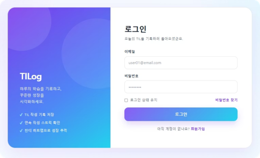
  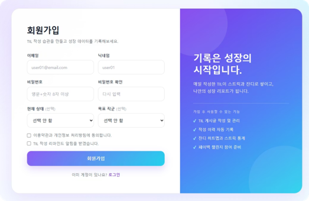
</p>

- 화면 UI는 팀원이 구현했고, 본인은 로그인 상태 관리·JWT 인증 연동을 담당했습니다.

### 메인 피드 · TIL 상세

<p>
  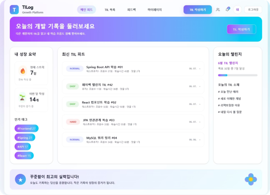
  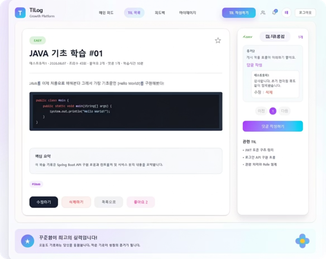
</p>

- TIL 상세 화면에서는 멘토 피드백 요청·확인을 사이드 패널로 함께 제공합니다.

### 마이페이지 `담당`

<p>
  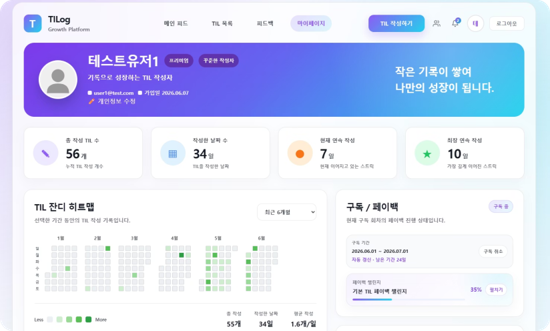
  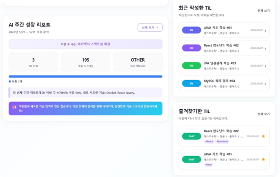
</p>

- 작성 이력·연속 작성일수(스트릭)·잔디 히트맵, 구독/페이백 현황을 한 화면에서 확인합니다.
- AI 주간 리포트 요약, 최근 작성한 TIL, 즐겨찾기한 TIL도 마이페이지에서 바로 확인할 수 있습니다.

### AI 주간 성장 리포트

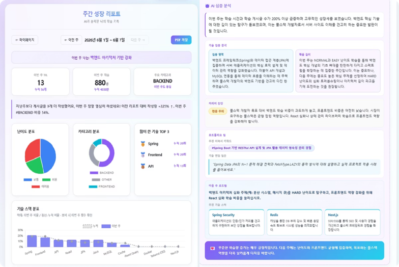

- 난이도/카테고리 분포, 기술 스택 TOP3, 규칙 기반 코멘트와 Gemini 기반 심층 분석을 함께 제공합니다.

### 멘토 피드백

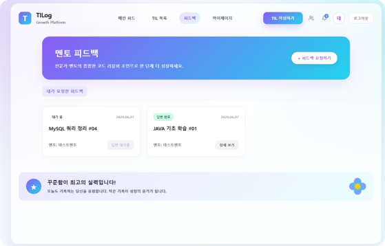

### 관리자

<p>
  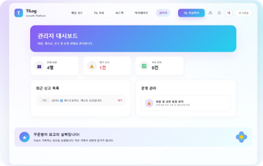
  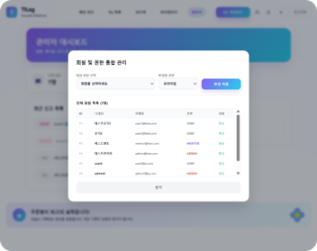
</p>

추가 화면과 전체 사용 흐름은 [시연 영상](https://www.youtube.com/watch?v=7DGHc91wHjw)에서 확인할 수 있습니다.

---

## 기술 스택

### Backend

- Java 21, Spring Boot 4.0
- Spring Data JPA, QueryDSL 5.1(Jakarta), MySQL
- Spring Security, JWT(jjwt 0.12)
- Google Gemini API(`gemini-2.5-flash`) — AI 주간 리포트, 게시글 요약
- Maven

### Frontend

- React 19, Vite 8, React Router 7
- Zustand(상태 관리), Axios
- Tailwind CSS 4
- Toast UI Editor(마크다운 에디터), react-markdown / remark-gfm / rehype-highlight
- Chart.js / react-chartjs-2(통계 차트)
- event-source-polyfill(SSE)

### 시스템 구성

| 구분 | 기술 |
|---|---|
| Frontend | React, Vite, React Router (`frontend/`) |
| Backend | Spring Boot REST API (`backend/`) |
| DB | MySQL |
| AI | Google Gemini API |
| 실시간 알림 | SSE |

### 아키텍처

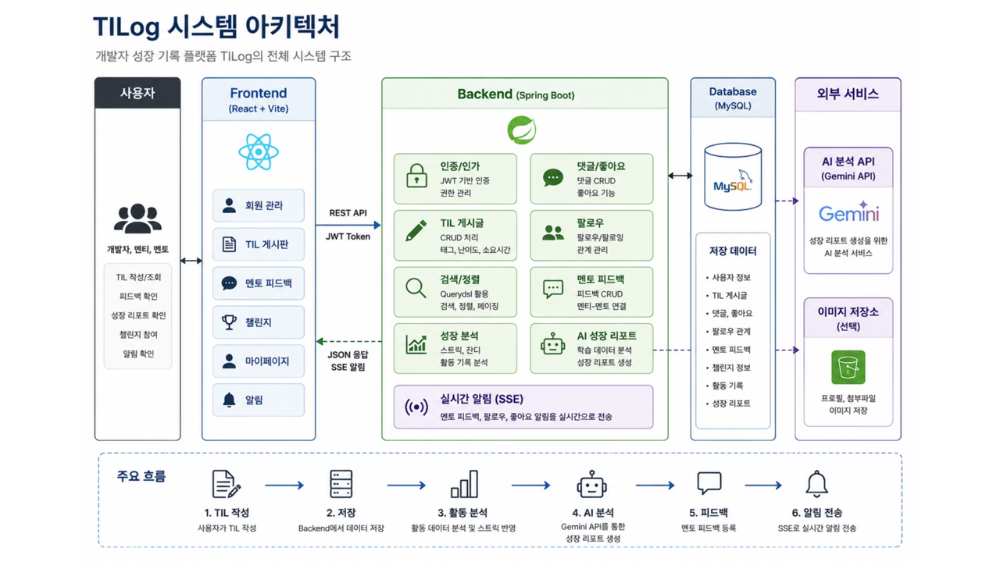

React 프론트엔드와 Spring Boot API 서버가 REST API(JWT 인증)로 통신하고, 활동 데이터는 MySQL에
저장합니다. 저장된 활동 기록을 바탕으로 Gemini API가 주간 성장 리포트를 생성하며, 멘토 피드백·
팔로우·좋아요 알림은 SSE로 실시간 전송됩니다.

### ERD

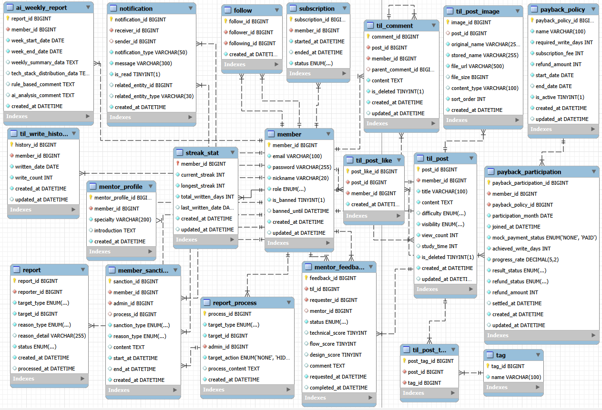

---

## 팀원 역할 분담

| 이름 | 담당 |
|---|---|
| 홍창희(팀장) | 작성 이력·스트릭·잔디 히트맵, 구독·페이백, 로그인 연동 |
| 박규태 | 회원가입·로그인(JWT 인증), 회원 프로필 관리 |
| 김진수 | TIL 게시글 CRUD, 기술 스택 태그 |
| 배재욱 | 댓글·좋아요·팔로우, 전체 피드 |
| 김기전 | 검색·페이징(QueryDSL) |
| 김민규 | 관리자·멘토 관리, 신고·제재 |

---

## 실행 방법

### 1. 사전 요구 사항

| 항목 | 버전 |
|---|---|
| JDK | 21 |
| MySQL | 8+ |
| Node.js | 20.19+ (Vite 8 요구 사항) |
| Git | 2.x 이상 |

### 2. 저장소 클론

```bash
git clone https://github.com/partmant/TILog.git
cd TILog
```

### 3. DB 준비

```sql
CREATE DATABASE tilog
CHARACTER SET utf8mb4
COLLATE utf8mb4_unicode_ci;
```

스키마는 JPA `ddl-auto: update` 설정으로 애플리케이션 최초 실행 시 자동 생성됩니다.

### 4. Backend 환경 설정

Spring Boot는 `.env` 파일을 자동으로 읽지 않습니다. 아래 값을 운영체제 환경변수, IDE 실행 설정,
또는 `backend/src/main/resources/application-local.yml`에 설정합니다. `local` 프로필은
`application.yaml`에 기본값(`spring.profiles.active: local`)으로 이미 지정되어 있어 별도
플래그 없이 `./mvnw spring-boot:run`만 실행하면 됩니다.

```env
DB_USERNAME=your_username
DB_PASSWORD=your_password

# Base64로 인코딩된 256bit 이상의 키 (운영에서는 반드시 환경변수로 주입)
JWT_SECRET=your_jwt_secret

# Gemini 기반 AI 주간 리포트 / 게시글 요약에 사용
# 값이 없어도 서버는 기동되지만, AI 관련 기능 호출 시 오류가 발생합니다.
GOOGLE_GEMINI_API_KEY=your_gemini_api_key
```

### 5. Backend 실행

```bash
cd backend
./mvnw spring-boot:run
```

서버는 기본적으로 `8080` 포트에서 실행됩니다. (DB: `jdbc:mysql://localhost:3306/tilog`)

### 6. Frontend 환경 설정

Backend와는 별도 터미널에서, 프로젝트 루트 기준으로 `frontend` 폴더에 `.env` 파일을 생성합니다.

```env
VITE_API_BASE_URL=http://localhost:8080
```

### 7. Frontend 실행

```bash
# 프로젝트 루트에서 (Backend를 실행 중인 터미널과는 별도 터미널)
cd frontend
npm install
npm run dev
```

---

## 패키지 구조

```
backend/src/main/java/com/tilog/
├── domain/
│   ├── auth/           # 회원가입·로그인·JWT [담당: 박규태]
│   ├── member/         # 회원 정보·프로필
│   ├── post/           # TIL 게시글 CRUD·상세·피드·검색 [담당: 김진수]
│   ├── comment/        # 댓글
│   ├── like/           # 좋아요
│   ├── follow/         # 팔로우
│   ├── tag/            # 기술 스택 태그
│   ├── writeHistory/   # 작성 이력 [담당]
│   ├── streak/         # 스트릭·잔디 히트맵 [담당]
│   ├── subscription/   # Mock 구독·취소예약·자동갱신 [담당]
│   ├── payback/        # 페이백 정책·참여 [담당]
│   ├── report/         # AI 주간 리포트(Gemini)
│   ├── feedback/       # 멘토 피드백
│   ├── notification/   # 인앱 알림·SSE
│   └── admin/          # 관리자 회원·게시글 관리
└── global/
    ├── security/       # JWT 인증·인가 [담당 일부: 프로젝트 초기 구성]
    ├── client/         # Gemini 클라이언트
    └── config/, exception/, response/, entity/

frontend/src/
├── api/                # 도메인별 API 모듈
├── pages/
│   ├── admin/          # 관리자 화면
│   ├── feed/           # 전체 피드
│   ├── feedbacks/      # 멘토 피드백
│   ├── mypage/         # 마이페이지 [담당]
│   └── post/           # TIL 작성·상세
├── components/
│   ├── mypage/         # 작성 이력·구독/페이백 UI [담당]
│   ├── report/         # 주간 리포트 차트
│   └── search/         # 검색·페이징
├── hooks/
│   ├── mypage/, post/, report/, sse/, common/
└── layouts/, router/, styles/, utils/
```

---

## 한계와 개선 방향

- 구독은 실제 결제 연동 없이 `createMock()`으로 즉시 활성화되는 Mock 구조입니다. 실제 결제(PG)
  연동 시에는 결제 승인·실패·환불 상태를 별도로 관리하고, 웹훅 기반 상태 동기화를 추가해야 합니다.
- 구독 만료·자동 갱신 스케줄러는 단일 인스턴스 운영을 전제로 하므로, 다중 인스턴스로 확장할
  경우 ShedLock 또는 DB 기반 분산 락 적용이 필요합니다.
